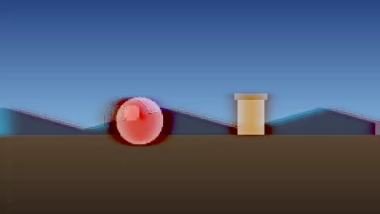
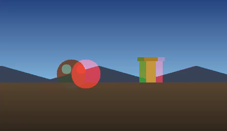
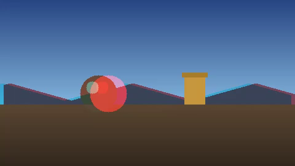
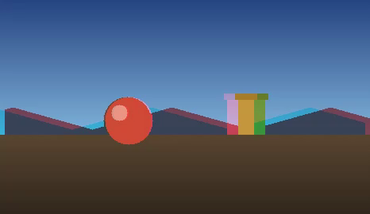
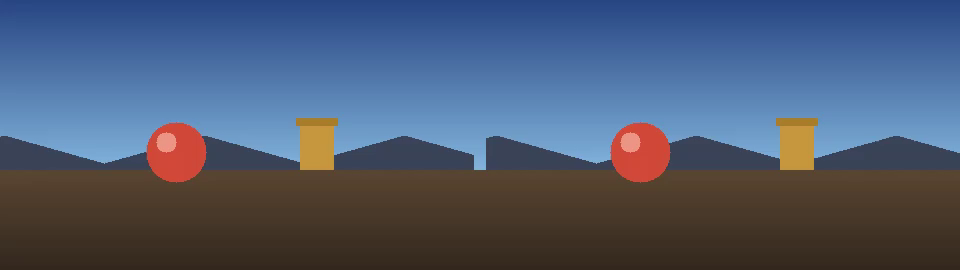

# User Guide

How to convert a film, and what every control does.

- [The short version](#the-short-version)
- [Source: what your file holds](#source-what-your-file-holds)
- [2D Source: the biggest improvement available](#2d-source-the-biggest-improvement-available)
- [Recovery: pulling the eyes apart](#recovery-pulling-the-eyes-apart)
- [Convergence: where the depth sits](#convergence-where-the-depth-sits)
- [Grade](#grade)
- [Destination](#destination)
- [Preview](#preview)
- [Range and alignment](#range-and-alignment)
- [Presets](#presets)
- [Troubleshooting](#troubleshooting)

---

## The short version

1. Open a film, or drop it on the window.
2. Set **Source → This file holds** to match what it actually is.
3. If you have a 2D version of the same film, open it too and say what it is.
4. Scrub to a frame worth judging — a face, a shot with real depth.
5. Adjust the sliders, watching the preview.
6. Choose a **Destination** and press Convert.

Most films need nothing beyond steps 1–2 and 5–6. The defaults are the values
the original AviSynth post recommends as a starting point.

### Something to practise on

[`docs/sample/stereo-sample-sbs.mp4`](sample/stereo-sample-sbs.mp4) is a
ten-second side-by-side clip built for exactly this. Open it and set **This file
holds** to *A stereo pair, side by side*.

It is worth knowing what is in it, because each piece is there to show you
something:

| In the scene | What it is for |
|---|---|
| The yellow post | Sits **exactly on the screen plane** — identical in both eyes. It never moves however you set Convergence, so it is the thing to judge everything else against. |
| The line of small posts | Each one further away than the last, so you can see depth in steps rather than as a single impression. |
| The blue card | Drifts along at a constant depth **behind** the screen. Its fringe never changes width. |
| The red ball | Crosses the frame while moving **towards you**, so its disparity grows as it comes. By the middle of its travel it is far enough forward to fringe badly — and no setting will fix that, which is the honest limit described in [What it cannot do](../README.md#what-it-cannot-do). |
| The strip along the bottom | A marker that crosses once, with a tick every second. It tells you which frame you are looking at. |

Try converting it to **Anaglyph** first. Every object's depth becomes directly
visible as the width of its colour fringe, and the post on the screen plane has
none at all. Then convert that anaglyph back with **This file holds → An
anaglyph** and compare: most of the scene comes back, and the ball does not.

### What recovery does

| The anaglyph you start with | One eye, recovered |
|---|---|
|  |  |

Each eye survives in the anaglyph only as brightness, and the colour you see is
a blend of both. Recovery takes each eye's brightness from the channels that
carried it and paints colour back on from a heavily blurred reference.

Look at the halo around the ball in the recovered frame. That is the limit of
the method, not a setting you have got wrong: the ball has large disparity, so
the anaglyph's colour there is mixed from two different points in the scene and
no amount of blur resolves it. A 2D version of the film removes it completely,
which is why the next section matters more than any slider.

All the figures in this guide are the converter's real output, generated by
`docs/make-figures.py`.

---

## Source: what your file holds

This must match reality or nothing else will make sense.

**An anaglyph** — one image with the two eyes encoded into colour channels.
Choose the colour mode: red/cyan is much the most common, then green/magenta,
then red/blue, then ColorCode. Recovery settings apply.

> **ColorCode 3-D** is the odd one out. Its amber filter passes red *and* green,
> so the left eye keeps nearly all the brightness and recovers well; the right
> eye gets blue alone, worth about seven percent of white's luminance. On the
> test scene that is 27.3 dB against 16.1. The depth comes back and the left eye
> looks good; the right eye is dim and noisy. That is the bargain the format
> strikes, and no setting will undo it — though a 2D source used as the *right*
> eye replaces the weak one outright, which is the one case where it matters
> more than usual.

**A side-by-side pair** or **a top-and-bottom pair** — already stereo. Nothing
needs recovering; the two eyes are simply taken apart, and the Recovery section
disappears because none of it applies.

**One eye, with the other in a second file** — two separate per-eye files. Open
the left with *Open Left Eye…* and the right with *Open Right Eye…*. If yours
are the other way round, tick **Swap eyes** rather than reopening them.

### Anamorphic

Only for packed pairs, and it matters.

Broadcast and disc stereo usually squeeze each eye to half size so the pair fits
one ordinary frame: a 1920×1080 file holding two 960×1080 eyes, each meant to be
seen at the full 1920×1080. **Tick anamorphic** and each eye is stretched back.

Full-resolution packing — a 3840×1080 frame holding two 1920×1080 eyes — needs
no stretch. **Leave it clear.**

If you get it wrong you will see it immediately: people come out **too narrow**
if it wanted ticking, **too wide** if it did not.

### Transfer

Which gamma curve the file uses. sRGB is right almost always. BT.709 suits some
broadcast masters. Linear is for material already in linear light, which is
rare. If unsure, leave it — the difference is subtle and sRGB is the safe guess.

---

## 2D Source: the biggest improvement available

Optional, and worth going to some trouble for.

The anaglyph's own colours are a blend of two views, and are wrong wherever
those views disagree — which is exactly where the depth is. A 2D transfer of the
same film fixes that. Many 3D discs carry one.

Once opened, say what it is:

**Colour reference only.** Both eyes are still recovered from the anaglyph; this
file supplies only hue. Use this when you have a 2D version but do not know
which eye it corresponds to, or it is a centre view.

**This is the left eye** / **This is the right eye.** That eye is not recovered
at all. It passes straight through, untouched and perfect, and only the other
eye is reconstructed — using this same file for its colour. This is the best
result the method can give.

The two files must line up. See [Range and alignment](#range-and-alignment).

> Not used with two per-eye files: both eyes are already complete, so there is
> no colour to supply and no eye to stand in for. The button is greyed out.

---

## Recovery: pulling the eyes apart

Only shown for anaglyph sources.

### Colour blur

Each eye survives as brightness; colour has to come from somewhere else, blurred
so it covers the horizontal offset between the two views.

**Lower percentages blur harder.** Horizontal wants far more than vertical,
because that is the direction the eyes are displaced in — vertical blur only
helps with cameras that were misaligned.

- Too little: colour fringes survive around objects at depth.
- Too much: colour bleeds across edges.

Defaults are 5% horizontal, 20% vertical. Note these are **pixel radii**, not
fractions of frame width, so the same setting is proportionally gentler on a
1080p transfer than on a DVD-sized one.

### Reconstruction

**Offset** is the default and the right choice for real film. It never divides,
so noisy shadows stay clean.

**Scale** is sharper on a clean source and preserves colour more exactly, but it
divides by the reference's brightness — and a red/cyan anaglyph's shadows are
exactly where that approaches zero. On grainy or heavily compressed film it
breaks dark areas into cyan speckle. It scores several dB *higher* on synthetic
tests, which is precisely why it is not the default: those tests have no grain.

### Ghosting

Removes each eye's ghost from the other, for cross-talk baked in during
mastering. Percentages, both directions independently.

It will **not** fix fringing caused by disparity. If raising it darkens the
picture rather than cleaning it, what you are looking at is disparity and this
is the wrong tool. On a well-made BluRay you may need none at all.

### De-fringe

Softens the white edges that excessive sharpening leaves on DVD-era transfers.
`1.0` is off. Try 1.5–4.0 if you see thin bright outlines at colour boundaries.

---

## Convergence: where the depth sits

Anaglyph releases were graded for a cinema screen and often for an audience the
film wanted to flinch. On a desk monitor the same disparity is simply painful,
and there is nothing in the recovery itself that fixes it.

Convergence shifts the two eyes horizontally against each other. Negative brings
them together, pulling the whole scene forward towards the viewer; positive
pushes it back behind the screen. What you are really moving is the plane of
zero parallax — the depth at which the two eyes agree exactly, which the viewer
reads as *the screen*. Put that plane on the ground under your subject and the
shot settles down.

The control is a percentage of frame width, and the app shows what that costs
in pixels for the file you have open. Only the region both eyes still cover can
be kept, so the output narrows by exactly that percentage: 2% of a 1920-wide
frame gives up 38 pixels. The picture is cropped, never squeezed — the shape it
displays at narrows with it, so nothing stretches.

These are the same scene at three settings, shown as anaglyph because the
fringe on an object *is* its disparity — the wider the colour fringe, the
further the object sits from the screen.

| −3%, scene forward | 0%, unchanged | +3%, scene back |
|---|---|---|
|  |  |  |

In the middle frame the post has no fringe: it is exactly on the screen plane.
At **+3%** the fringe has moved off the ball and onto the post — the ball is now
what sits on the screen, and everything else has receded behind it. At **−3%**
the ball has come further forward still and the post has gone in front of the
screen with it.

That is the whole control: you are choosing which object the viewer's eyes rest
on. Notice too that the outer frames are narrower than the middle one, by
exactly the percentage asked for.

A little goes a long way. Beyond about 3% you are usually fixing the wrong
problem, and the limit is 10%.

Judge it with the glasses off, watching how far the two images separate on the
objects you care about, then check it in the preview.

## Grade

Per-eye brightness, contrast and saturation. Recovery routinely leaves one eye
darker or flatter than the other — the two anaglyph channels never carried equal
energy — so each eye is corrected separately.

A 2D source used as an eye passes through **ungraded**. That is deliberate: the
grade exists to bring the *recovered* eye into line with the perfect one.

---

## Destination

| Layout | Result |
|---|---|
| Side by side | One file, twice as wide. What most 3D displays and headsets expect. |
| Top and bottom | One file, twice as tall. |
| Two files, one per eye | `-left` and `-right` added to the name you choose. |
| Anaglyph | Muxed back for ordinary screens and the old glasses. |
| Left eye only / Right eye only | A flat 2D file. |

Side by side, the layout most displays and headsets expect. The frame is twice
as wide as one eye, and carries a display aspect that tells a player to show it
that way rather than stretching it.

**Anaglyph colour mode** is independent of the source's. Recovering a red/cyan
transfer and writing green/magenta is perfectly reasonable — green/magenta holds
colour better and ghosts less on many screens. ColorCode is also available, and
gives the brightest, most colourful result of the four through its own glasses.

**Eye order** says which eye is written first, labelled by position: *on the
left* for side-by-side, *on top* for top-and-bottom.

**Codec.** Hardware H.264 or HEVC are fast on Apple Silicon and right for
watching. Software versions are slower but byte-identical on any machine, which
matters if you need reproducibility. ProRes HQ is for keeping a master to grade
or re-encode later.

Pixel shape is carried through from the source, so a transfer with non-square
pixels comes out the right shape rather than stretched.

---

## Preview

The preview shows the conversion itself, not an approximation, and honours the
source's pixel shape. It is drawn at reduced resolution for speed, with the blur
settings rescaled to match, so what you tune against is what you get.

| View | Shows |
|---|---|
| Left / Right | One recovered eye on its own |
| Side by side | Both, as the output will be packed |
| Anaglyph | The result re-encoded, to check through the glasses on your desk |
| Difference | Where the two eyes disagree — this is the depth |

The readout under the buttons gives milliseconds per frame and the preview
scale, which is a fair guide to how long a full render will take.

---

## Range and alignment

Every source has its own in and out points. The main source's range decides the
length of the output; the others are read in step with it.

A 2D release and the anaglyph rarely start on the same frame — different
distributors, different logos, different credit rolls. **Align sources…** shows
both side by side with independent scrubbers:

1. Scrub each to the same visual moment. A cut is easiest to match on.
2. **Mark in on both.**
3. Scrub to where you want to finish and **Mark out on both**.

The smaller buttons set one side only, for nudging without disturbing a good
mark on the other. A live offset readout shows how far apart the two positions
are. Both ranges are shown underneath as timecodes.

Times are also accepted on the command line: `--start 3:15`, or `--start 5850f`
for an exact frame.

---

## Presets

**Save preset…** writes every setting as JSON. **Load preset…** brings it back.
Keep one per film, the way the original AviSynth workflow kept a `.avs` file per
movie.

The command line reads and writes the same files, so a look tuned in the app can
be rendered headlessly — useful for converting a feature overnight.

---

## Troubleshooting

**Everyone is too narrow, or too wide.** The anamorphic setting is wrong for
your file. Too narrow means it wanted ticking; too wide means it did not.

**Dark areas break into coloured speckle.** Reconstruction is set to Scale on
grainy material. Use Offset.

**Colour fringes survive around objects that stick out.** Either lower the
horizontal blur percentage, or — better — find a 2D version of the film. Where
the eyes are far apart no blur setting can fix it, because the anaglyph's colour
there is composed from two different points in the scene.

**Raising Ghosting darkens the picture instead of cleaning it.** That fringing
is disparity, not cross-talk. Put Ghosting back to zero.

**The 2D source is a different resolution.** That is fine and normal; it is
resized to fit. If it is a different *shape* you will be told, because resizing
will stretch it — a 16:9 transfer against a scope-cropped anaglyph needs cropping
to match before it is much use.

**"has no audio stream to copy".** The file named for audio has no audio track.
Leave the audio source unset for a silent film.

**The app cannot find ffmpeg.** Only possible in a development build. Run
`"Stereoscopic Converter" --check` to see what it resolved. The bundled `.app` carries
its own and cannot hit this.
